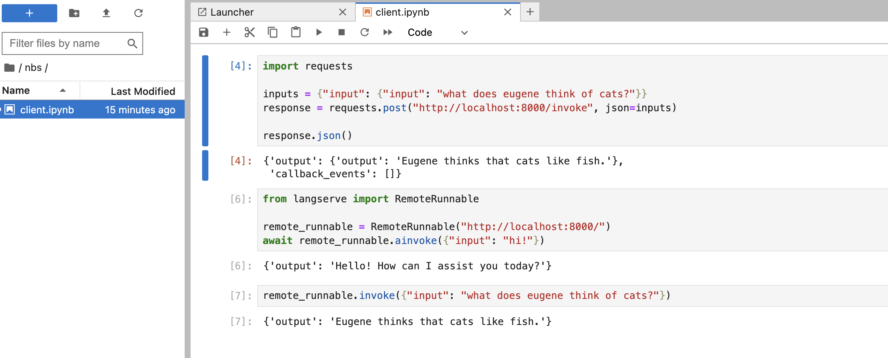

# Template For Starting LangServe Projects

---

<br>

## Setup Installs

```
pip install -r requirements.txt
```

<br>

## Server/Client

**[optional] Activate Virtual Env**

Run from project root:

```
source venv/bin/activate
```

**Run Server**

Run from project root:

```
python -m langserve_template.server
```

**Run Jupyter Notebook As Demo Client**

Run from project root:

```
jupyter-lab
```

Navigate to the `nbs/client.ipynb` file and open the notebook to explore clientside behaviours as shown below:



<br>

---

